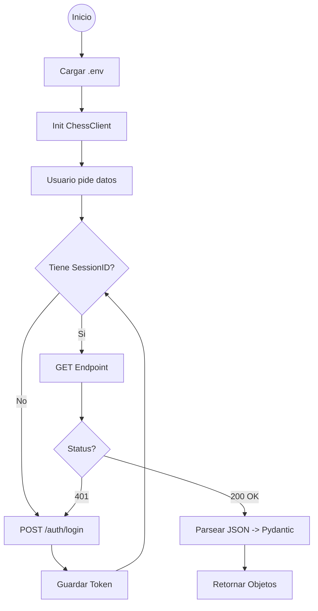

# Contexto del Proyecto: ChessERP API Python Library

## 1. Objetivo del Proyecto
Crear una **libreria de Python robusta y reutilizable** para interactuar con la API de ChessERP.
La libreria abstrae la complejidad de la autenticacion, manejo de sesiones y paginacion, permitiendo a los desarrolladores extraer y manipular datos (Ventas, Stock, Clientes, etc.) mediante objetos Python tipados y sencillos.

## 2. Estado Actual (Snapshot)
*   **Fecha**: 18 de Febrero de 2026
*   **Version**: 0.1.0 (Alpha)
*   **Python requerido**: >= 3.10
*   **Fase**: Pruebas de Integracion y Uso Real.
*   **Status**:
    *   La migracion de `src/` a `chesserp/` esta **completa**.
    *   El refactor de Stock para usar `ChessClient` unificado esta **completo**.
    *   Se soporta la generacion y descarga de reportes de ventas via `export_sales_report()`.
    *   Se implementaron **8 endpoints** con soporte raw y parsed (Pydantic).
    *   `live_test.py` permite validar todos los modelos contra la API real.
    *   `usage_example.py` ofrece un menu interactivo para pruebas manuales.
    *   `pyproject.toml` esta configurado para instalacion via `pip install .` o `pip install -e .`
    *   **Los tests unitarios (`tests/test_client.py`, `tests/conftest.py`) fueron eliminados** en un commit anterior. Actualmente no hay tests automatizados con pytest.
    *   **Faltan archivos `__init__.py`** en `chesserp/` y `chesserp/models/`. El paquete funciona por namespace packages de Python 3.3+, pero es mejor practica agregarlos.

## 3. Arquitectura

### Componentes Principales
*   **`chesserp/client.py` (Core)**: Cliente principal. Maneja la sesion (`requests`), reintentos de login automaticos (401) y metodos de acceso a datos con paginacion transparente.
*   **`chesserp/models/`**: Definiciones de datos usando **Pydantic v2**. Garantiza que los JSONs de la API se conviertan en objetos validados con autocompletado.
*   **`chesserp/stock.py` (Servicio)**: Capa de servicio que usa `ChessClient` para logica de negocio de stock (transformacion, cruce con maestros, pivot con pandas).
*   **`chesserp/sales.py` (Servicio)**: Capa de servicio para ventas. **Actualmente es un stub incompleto** (tiene un metodo vacio `process_data_reports`).
*   **`chesserp/config/settings.py`**: Manejo de configuracion con Pydantic (paths, log levels). **No maneja credenciales** - esas se pasan directo al `ChessClient`.
*   **`chesserp/exceptions.py`**: Jerarquia de excepciones: `ChessError` > `AuthError`, `ApiError`.
*   **`chesserp/logger.py`**: Logger centralizado con soporte file + console, formato configurable.

### Endpoints Implementados en `ChessClient`

| Metodo | Endpoint API | Modelo Pydantic | Paginado |
|--------|-------------|-----------------|----------|
| `get_sales()` / `get_sales_raw()` | `ventas/` | `Sale` | Si (lotes) |
| `get_articles()` / `get_articles_raw()` | `articulos/` | `Articulo` | Si (lotes) |
| `get_stock()` / `get_stock_raw()` | `stock/` | `StockFisico` | No |
| `get_customers()` / `get_customers_raw()` | `clientes/` | `Cliente` | Si (lotes) |
| `get_orders()` / `get_orders_raw()` | `pedidos/` | `Pedido` | No |
| `get_staff()` / `get_staff_raw()` | `personalComercial/` | `PersonalComercial` | No |
| `get_routes()` / `get_routes_raw()` | `rutasVenta/` | `RutaVenta` | No |
| `get_marketing()` / `get_marketing_raw()` | `jerarquiaMkt/` | `JerarquiaMkt` | No |
| `export_sales_report()` | `reporteComprobantesVta/exportarExcel` | (bytes) | No |

### Diagrama de Flujo de Ejecucion



## 4. Estructura de Archivos
```text
chesserp-api/
├── chesserp/                    # Paquete principal (FALTA __init__.py)
│   ├── client.py               # Cliente principal unificado (~756 lineas)
│   ├── exceptions.py           # ChessError, AuthError, ApiError
│   ├── logger.py               # Logger centralizado (file + console)
│   ├── sales.py                # Servicio ventas (STUB INCOMPLETO)
│   ├── stock.py                # Servicio stock (funcional, usa pandas)
│   ├── config/
│   │   └── settings.py         # PathConfig, LogLevel, Settings
│   └── models/                 # Modelos Pydantic v2 (FALTA __init__.py)
│       ├── sales.py            # Sale (150+ campos)
│       ├── inventory.py        # Articulo, StockFisico, AgrupacionArticulo
│       ├── clients.py          # Cliente, ClienteAlias, ClienteFuerza
│       ├── orders.py           # Pedido, LineaPedido
│       ├── routes.py           # RutaVenta, ClienteRuta
│       ├── staff.py            # PersonalComercial
│       └── marketing.py        # JerarquiaMkt, CanalMkt, SubCanalMkt
├── tests/                       # (SIN TESTS .py - solo notebooks y xlsx)
│   └── data_tests.ipynb        # Notebook exploratorio
├── main.py                      # Script batch: exporta ventas 2024-2025 a CSV
├── live_test.py                 # Testing class contra API real (~795 lineas)
├── usage_example.py             # Menu interactivo de pruebas manuales
├── pyproject.toml               # Config de proyecto, deps, pytest, coverage
├── requirements.txt             # Dependencias (runtime + dev)
├── .gitignore                   # Excluye .env, logs, data files
├── .env                         # Credenciales (NO trackeado en git)
├── CLAUDE.md                    # Este archivo
├── PROJECT_CONTEXT.md           # Contexto tecnico detallado
├── PENDIENTES.md                # Lista de tareas pendientes
└── README.md                    # Documentacion de usuario
```

## 5. Variables de Entorno (.env)
El patron actual usa prefijos por empresa:
```
EMPRESA1_API_URL=http://servidor:puerto/
EMPRESA1_USERNAME=usuario
EMPRESA1_PASSWORD=clave

EMPRESA2_API_URL=http://servidor:puerto/
EMPRESA2_USERNAME=usuario
EMPRESA2_PASSWORD=clave
```

**Uso en codigo:**
```python
from chesserp.client import ChessClient

# Desde variables de entorno con prefijo
client = ChessClient.from_env(prefix="EMPRESA1_")

# O directo con credenciales
client = ChessClient(
    api_url="http://servidor:puerto",
    username="usuario",
    password="clave"
)
```

## 6. Comandos de Desarrollo

### Instalacion
```bash
pip install -e .          # Modo desarrollo (editable)
pip install -e ".[dev]"   # Con dependencias de testing
```

### Testing contra API real
```bash
python live_test.py --prefix EMPRESA1_ --test all
python live_test.py --prefix EMPRESA1_ --test sales
python live_test.py --test quick
```

### Menu interactivo
```bash
python usage_example.py
```

## 7. Problemas Conocidos
1. **`chesserp/sales.py`**: Metodo `process_data_reports()` vacio (error de sintaxis).
2. **`main.py`**: Usa variables de entorno legacy (`API_URL_B`, `USERNAME_B`) en vez del patron con prefijo.
3. **`usage_example.py`**: Llama a `get_marketing_hierarchy()` que no existe (deberia ser `get_marketing()`).
4. **`live_test.py:158`**: Bug logico en `_flatten_routes` - la condicion `if ruta.cliente_rutas:` deberia ser `if not ruta.cliente_rutas:`.
5. **Sin `__init__.py`**: Los paquetes `chesserp/` y `chesserp/models/` no tienen `__init__.py`.
6. **Sin tests unitarios**: Los archivos pytest fueron eliminados en commit `6b93644`.
7. **Sin `.env.example`**: No existe archivo de ejemplo para las variables de entorno.
