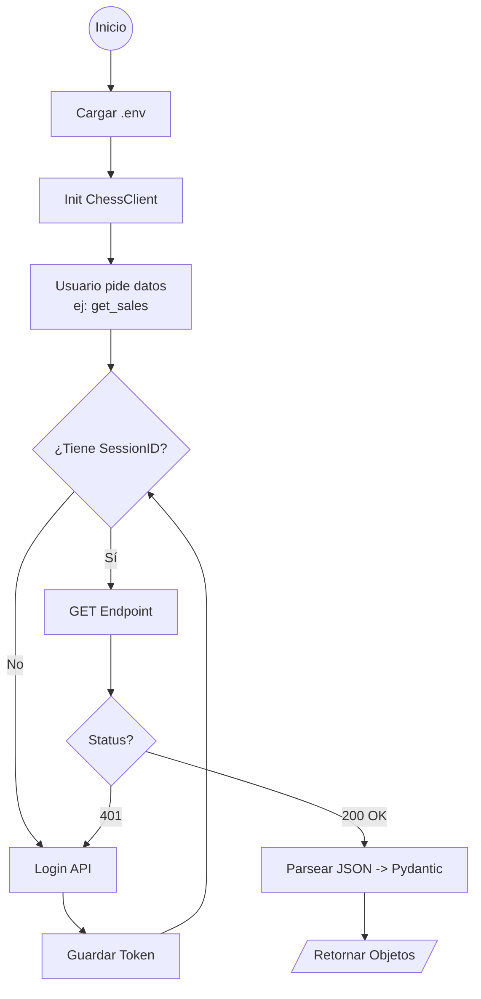

# Contexto del Proyecto: ChessERP API Python Library

## 1. Objetivo del Proyecto
Crear una **librería de Python robusta y reutilizable** para interactuar con la API de ChessERP.
La librería debe abstraer la complejidad de la autenticación, manejo de sesiones y paginación, permitiendo a los desarrolladores extraer y manipular datos (Ventas, Stock, Clientes, etc.) mediante objetos Python tipados y sencillos.

## 2. Estado Actual (Snapshot)
*   **Fecha**: 27 de Noviembre de 2025
*   **Fase**: Pruebas de Integración y Uso Real.
*   **Documentación de Referencia**: Se utiliza el archivo `Cat__logo API ChessERP.html` (ubicado en la raíz) como la fuente oficial de documentación para los endpoints de la API.
*   **Status**:
    *   ✅ **Migración Completa**: Se eliminó el código legacy (`src/endpoints.py`).
    *   ✅ **Refactor Stock**: `src/stock.py` ahora utiliza el cliente unificado `ChessClient`.
    *   ✅ **Reportes**: `src/client.py` soporta la generación y descarga de reportes de ventas.
    *   ✅ Se han implementado tests unitarios básicos (`tests/test_client.py`) con `pytest` y `requests-mock`.

## 3. Arquitectura

### Componentes Principales
*   **`src/client.py` (Core)**: Es el cliente principal. Maneja la sesión (`requests.Session`), reintentos de login automáticos y métodos de acceso a datos (ej: `get_sales`, `export_sales_report`).
*   **`src/models/`**: Definiciones de datos usando **Pydantic**. Esto garantiza que los JSONs de la API se conviertan en objetos validados con autocompletado (ej: `Sale`, `StockFisico`).
*   **`src/stock.py` (Servicio)**: Ejemplo de capa de servicio que utiliza `ChessClient` para lógica de negocio específica (transformación de datos de stock, cruce con maestros, etc.).
*   **`src/config/settings.py`**: Manejo centralizado de configuración (URLs, Credenciales) usando variables de entorno (`.env`).

### Diagrama de Flujo de Ejecución



## 4. Estructura de Archivos Clave
```text
/
├── src/
│   ├── client.py       # Cliente principal unificado
│   ├── stock.py        # Servicio de gestión de stock (usa client.py)
│   ├── models/         # Modelos de datos (Sales, Inventory, etc.)
│   └── config/         # Configuración y validación de .env
├── tests/
│   ├── conftest.py     # Configuración de fixtures para pytest
│   └── test_client.py  # Tests unitarios del cliente
├── main.py             # Script de uso (pendiente de actualización)
└── requirements.txt    # Dependencias
```

## 5. Próximos Pasos (Roadmap)
1.  **Pruebas Reales**: Crear script `live_test.py` para validar contra la API real.
2.  **Validación de Modelos**: Ajustar modelos Pydantic (`src/models/`) según las respuestas reales de la API (campos opcionales, typos en la API, etc.).
3.  **Empaquetado**: Crear `pyproject.toml` para hacer la librería instalable (`pip install .`).
4.  **Cobertura**: Agregar tests para endpoints de Stock y Clientes.
